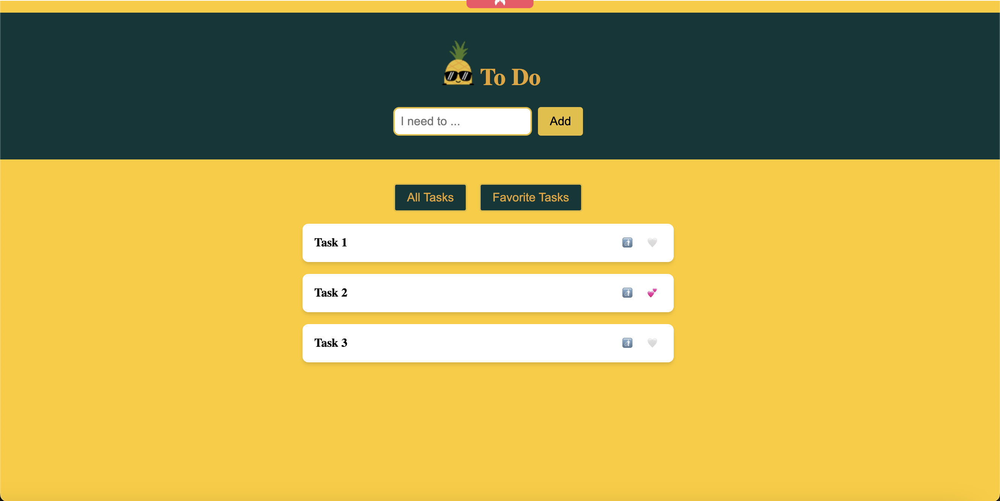
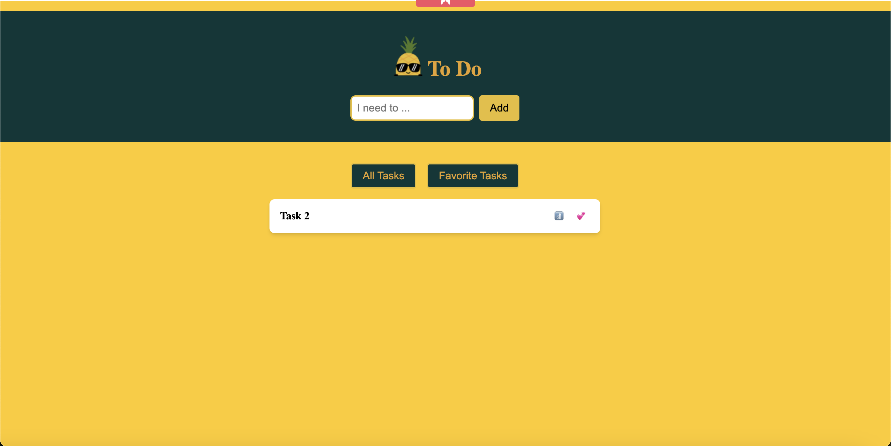

# TP Store Pinia

## Objectifs

- Créer un store avec Pinia
- Utiliser le store dans un composant

## Préparatifs

- reprendre le code du TP précédent 
- reproduire l'application montré en vidéo

## Screenshots de l'application

<!-- Screenshot of app -->

<!-- Screenshot of favorite tasks view -->
